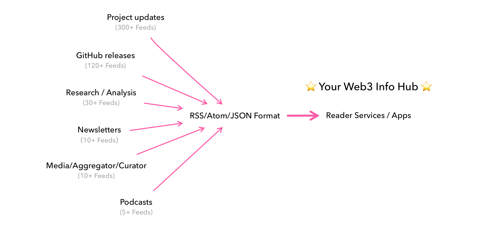
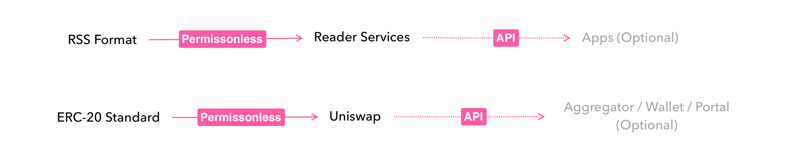

# RSS Aggregator for Web3 (or 🥩 RAW for short)

Bootstrapping your personal Web3 info hub from more than 600 RSS Feeds.

## What is RSS or Reader Services?

RSS is a standard for contents feeds. Any website supporting this standard can be permissionless aggregated to RSS Reader Service or Apps.

"RSS to Reader" is just like "ERC-20 to Uniswap".

## How to use 🥩 RAW? Just 4 steps.
1. [Download](https://github.com/chainfeeds/RSSAggregatorforWeb3/releases/latest/download/RAW.opml) the the latest RAW.opml file from this repo.
2. Choose your favorite RSS service or apps. (I strongly recommend [NetNewsWire](https://netnewswire.com) as a fresh start because it's totally free and [open sourced](https://github.com/Ranchero-Software/NetNewsWire).)
3. Import this OPML to your apps/services.
4. Syncing and Done!

## How to find/add new feeds?

Medium, Github, Substack, Mirror, Ghost are natively support RSS.

For example,

- GitHub: Appending ".atom" to most links, e.g. https://github.com/bitcoin/bitcoin/releases.atom
- Substack: Appending "/feed" to link, e.g. https://0xsoros.substack.com/feed
- Mirror: Appending "/feed/atom" to link, e.g. https://ens.mirror.xyz/feed/atom
- Ghost: Appending "/rss" to link, e.g. https://fuel-labs.ghost.io/rss/
- Medium: Adding "/feed" after medium.com, e.g. https://medium.com/feed/anomanetwork

For other sites or sources, you can find many great tutorials from [ALL About RSS](https://github.com/AboutRSS/ALL-about-RSS) or [RSSHub](https://github.com/DIYgod/RSSHub).

## How many feeds I can find in 🥩 RAW?

You can find the full list [here](Full_List). Breakdown:

- Direct source from projects: 300+ Feeds
    - Including product announcements/updates from L1/L2 Chains, Web3 DApps, Developer Tools.
- GitHub updates: 120+ Feeds
    - Including code releases or smart contract upgrades from L1/L2 Chains, Web3 DApps, Developer Tools.
- Media/Curator/Aggregator: 10+ Feeds
    - Including press or content aggregator like CoinDesk, Messari.
- Newsletters: 10+ Feeds
    - Including weekly newsletters like Week in Ethereum, Bitcoin Optech.
- Research/VCs: 30+ Feeds
    - Indluding deep dive research or analysis contents from independent researchers or VCs.
- Others: 2 Feeds
    - Including forum, communities.

## Recommendation of RSS Aggregating Service
- ~~Google Reader~~
- [Inoreader](https://www.inoreader.com)
- [Feedbin](https://feedbin.com)
- [Feedly](https://feedly.com)
- [Feeder](https://feeder.co)

## Recommendation of App/Client
- [NetNewsWire](https://netnewswire.com) (Free!)
- [Planet](https://www.planetable.xyz) (Free!)
- [Thunderbird](https://www.thunderbird.net) (Free!)
- [An Otter RSS](https://anotterrss.com) (Free!)
- [Fluent Reader](https://hyliu.me/fluent-reader/) (Free!)
- [Feedbro](https://nodetics.com/feedbro/) (Free!)
- [Raven Reader](https://ravenreader.app/) (Free!)
- [Reeder](https://reederapp.com)
- [Big News](https://bignews.app)
- [News Explorer](https://betamagic.nl/products/newsexplorer.html)

## More Tutorials
- by [@lufeieth](https://twitter.com/lufeieth/status/1526966204723699712): https://cryptotimemachine.notion.site/Chainfeeds-RAW-opml-2022-5-18-ab0889dda6ca4d73abbefe98e9f51f49
- by [@zjavax](https://twitter.com/zjavax/status/1528553122703872000): https://www.youtube.com/watch?v=dabK4vLpQ9k
- by [@zlexdl](https://twitter.com/zlexdl/status/1528585260228694019): https://mirror.xyz/zlexdl.eth/7vAc_B_I8WdJ6Eiyp4nWgGX2lMtPKCifUI3wPEM0rTM

## Based on 🥩 RAW
- All-in-one Feed by [@RoCry](https://twitter.com/RoCry/status/1528045325969424384): https://github.com/roallop/feedcooker/releases/tag/latest
- Telegram Channel by [@Tweet_TgBot](https://twitter.com/Tweet_TgBot/status/1528411501127954432): [t.me/web3_rss](t.me/web3_rss)

## Other Web3 related Feeds:
- 900+ Mirror Author by [@zlexdl](https://twitter.com/zlexdl/status/1526945751573536771): https://github.com/zlexdl/mirror
- PrimitivesFeed：https://github.com/PrimitivesLane/PrimitivesFeed
